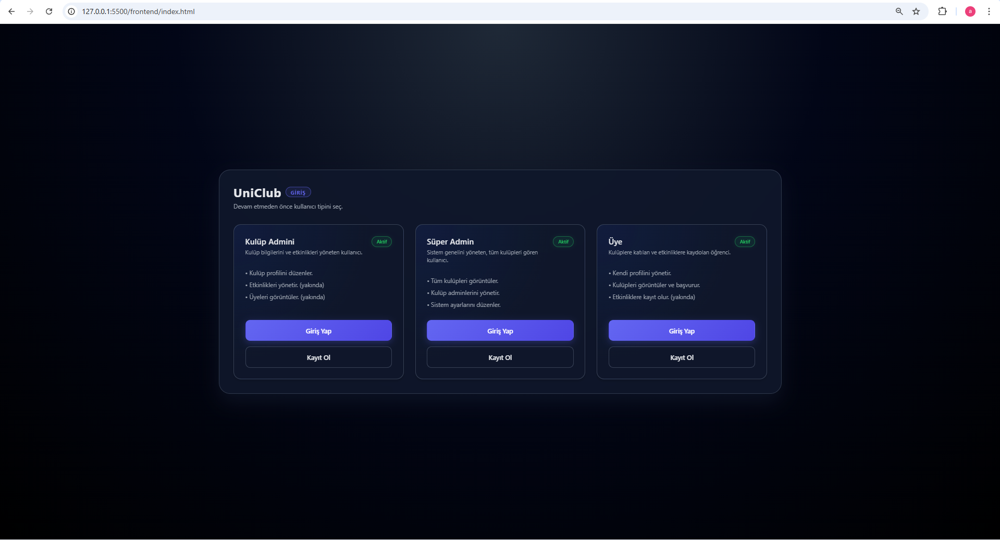
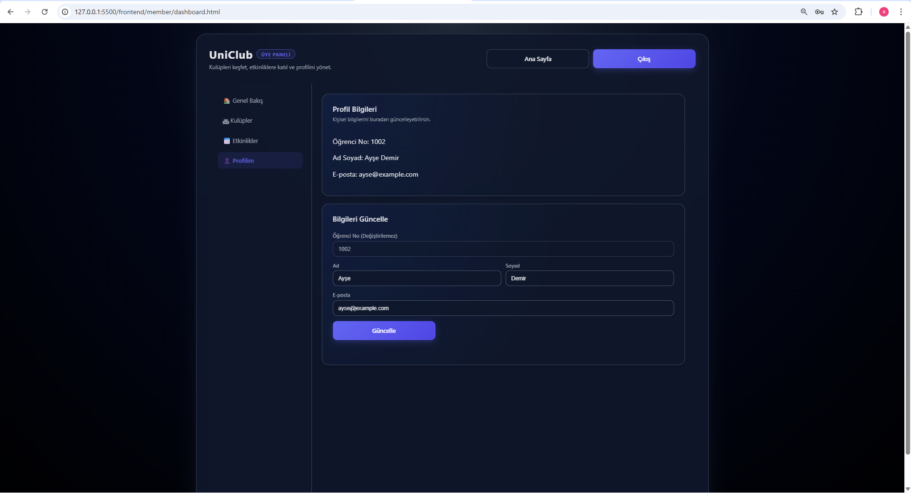
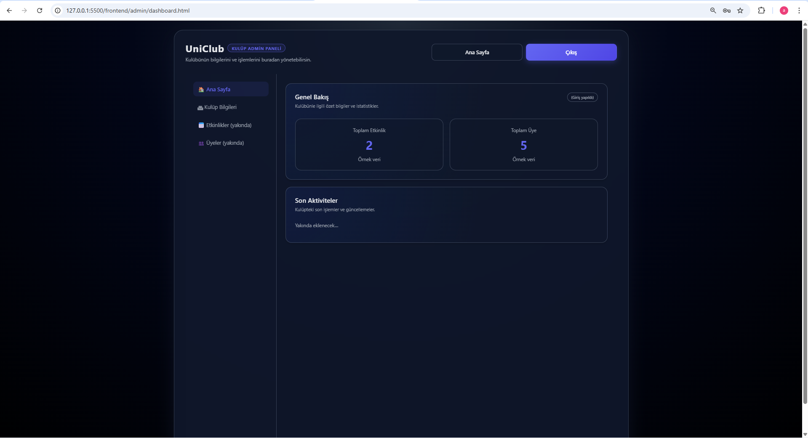
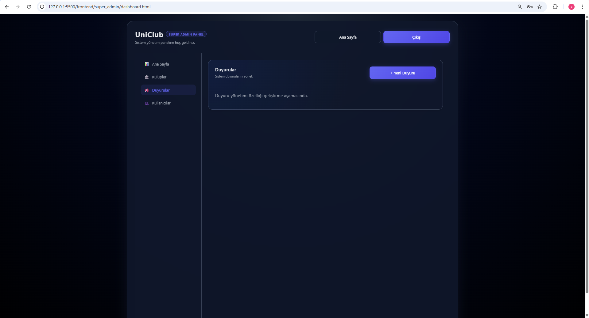

# UniClub (Sprint 1 - MVP) 

**Üniversite Kulüp Yönetim Sistemi**
## Contributors
- Burakhan Saruhan
- Alihan Uludağ
- İclal Ertürk
UniClub, üniversite öğrencilerinin kulüpleri keşfetmesini, kulüp yöneticilerinin topluluklarını yönetmesini ve süper yöneticilerin sistemi denetlemesini sağlayan kapsamlı bir platformdur.

**Kasım 2025** itibarıyla **Sprint 1** tamamlanmış ve **MVP (Minimum Viable Product)** sürümü yayınlanmıştır.

---

## 📅 Proje Durumu & Yol Haritası (Roadmap)

ByteFix GO Product Roadmap doğrultusunda Kasım ayı hedefleri başarıyla gerçekleştirilmiştir.

| Hedef Tarih | Sürüm | Durum | Kapsam |
| :--- | :--- | :--- | :--- |
| **Kasım 2025** | **MVP** | ✅ **Tamamlandı** | Öğrenci/Kulüp üyelikleri, Oturum Açma, Temel Dashboardlar |
| Aralık 2025 | V1 | ⏳ Bekleniyor | Kulüp Detay Sayfaları, Başvuru Yönetimi, Filtreleme |
| Ocak 2026 | V2 | ⏳ Bekleniyor | Etkinlik Oluşturma, Kayıt/İptal İşlemleri |

### 🏆 Sprint 1 Kazanımları (Tamamlanan Özellikler)
* **Kimlik Doğrulama (Auth):** JWT tabanlı güvenli Giriş (Login) ve Kayıt (Register) sistemi.
* **Rol Bazlı Erişim:**
    * **Üye (Öğrenci):** Kayıt olma, giriş yapma, profil görüntüleme ve kulüp listesini görme.
    * **Kulüp Admini:** Kulüp bilgilerini görüntüleme ve güncelleme.
    * **Süper Admin:** Sistem genelindeki kulüp ve kullanıcı sayılarını izleme.
* **Modern Arayüz:** Responsive, CSS Grid tabanlı, koyu mod (dark theme) tasarımı.
* **Backend API:** FastAPI, SQLAlchemy ve SQLite ile sağlam bir altyapı.

---

---

## 📸 Ekran Görüntüleri

### Giriş ve Rol Seçimi
Kullanıcılar sisteme girmek istedikleri rolü (Öğrenci, Kulüp Admini, Süper Admin) buradan seçerler.


### Üye Paneli (Öğrenci)
Öğrenciler kendi profillerini yönetebilir ve aktif kulüpleri listeleyebilir.


### Kulüp Yönetim Paneli
Kulüp yöneticileri, kulüplerine ait özet bilgilere (üye sayısı, etkinlik sayısı) buradan erişir.


### Süper Admin Paneli
Sistem genelindeki tüm metriklerin (Toplam Kulüp, Kullanıcı vb.) görüntülendiği yönetim ekranı.


---

## 🛠 Kurulum ve Çalıştırma

Projeyi yerel makinenizde çalıştırmak için aşağıdaki adımları izleyin.

### Önkoşullar
* **Python 3.10+**
* **pip**

### 1. Backend (API) Kurulumu

```bash
cd backend

# Sanal ortam oluşturma (Önerilen)
py -m venv .venv
.\.venv\Scripts\Activate.ps1  # Windows için

# Bağımlılıkları yükle
pip install -r requirements.txt
# veya manuel: pip install fastapi "uvicorn[standard]" sqlalchemy python-dotenv passlib python-jose[cryptography]

# Veritabanını oluştur ve örnek verileri yükle (ÖNEMLİ ADIM)
python -m app.tools.sample_data

# Sunucuyu başlat
uvicorn app.webAPI_layer.main:app --reload --host 127.0.0.1 --port 8000
2. Frontend (Arayüz) Kurulumu
Frontend saf HTML/JS/CSS olduğu için herhangi bir derlemeye ihtiyaç duymaz.

VS Code Live Server (Önerilen): frontend/index.html dosyasına sağ tıklayıp "Open with Live Server" diyerek açın.

Python ile:

Bash

cd frontend
py -m http.server 5500
Tarayıcıda http://127.0.0.1:5500 adresine gidin.

📂 Klasör Yapısı
uni-club/
├─ backend/
│  ├─ app/
│  │  ├─ business_layer/     # İş mantığı servisleri (Auth vb.)
│  │  ├─ data_access_layer/  # Veritabanı modelleri ve bağlantısı
│  │  │  └─ database/        # uniclub.db burada oluşur
│  │  ├─ tools/              # Örnek veri scriptleri (sample_data.py)
│  │  └─ webAPI_layer/       # Routerlar ve Main.py
│  └─ requirements.txt
└─ frontend/
   ├─ admin/                 # Kulüp Admin sayfaları
   ├─ member/                # Öğrenci (Üye) sayfaları
   ├─ super_admin/           # Süper Admin sayfaları
   ├─ screenshots/           # Proje görselleri (landing.png vb.)
   ├─ index.html             # Karşılama ekranı
   ├─ styles.css             # Global stil dosyası
   └─ app.js                 # Genel scriptler

Geliştirici: ByteFix Ekibi | Kasım 2025
